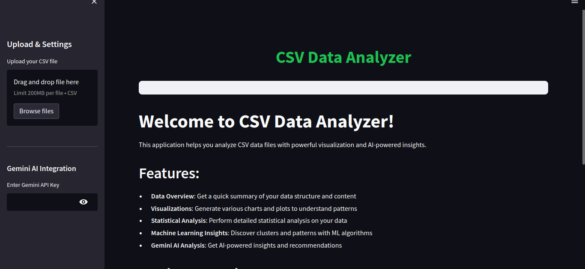

# CSV Data Analyzer

A powerful data analysis application built with Python, Streamlit, and Google's Gemini AI that allows users to upload their own CSV files and get comprehensive analysis results.

## Features

- **Data Overview**: Quick summary of data structure, content, and basic statistics
- **Visualizations**: Interactive charts and plots including histograms, box plots, correlation heatmaps, and scatter plots
- **Statistical Analysis**: Detailed statistical analysis with descriptive statistics and group-by analysis
- **Machine Learning Insights**: Discover patterns with PCA and K-means clustering
- **Gemini AI Analysis**: AI-powered insights and recommendations (requires Gemini API key)

## Requirements

- Python 3.6+
- Streamlit
- Pandas
- Matplotlib
- Seaborn
- Scikit-learn
- Google Generative AI Python SDK

## Installation

```bash
pip install streamlit pandas matplotlib seaborn scikit-learn google-generativeai
```

## Usage

1. Run the application:
```bash
streamlit run app.py
```

2. Upload your CSV file using the sidebar
3. Optionally, add your Gemini API key for AI-powered analysis
4. Explore the different tabs to analyze your data

## Sample Data

A sample dataset (`sample_data.csv`) is included for testing purposes.

[](https://drive.google.com/file/d/1k-lLvTqXvn6jVPf7veY1Jd1Q4DgUGHo1/view?usp=sharing)

