# Architecture

System design and data flow documentation for DataLens.

## High-Level Architecture

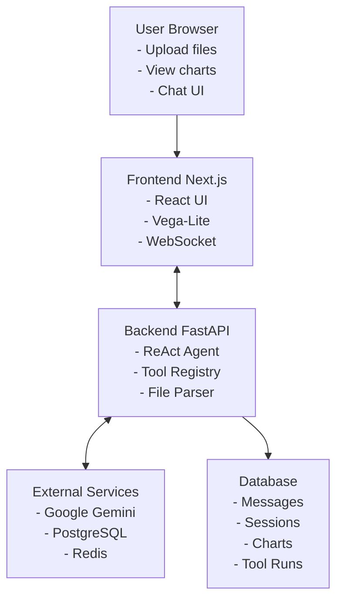

## Component Diagram

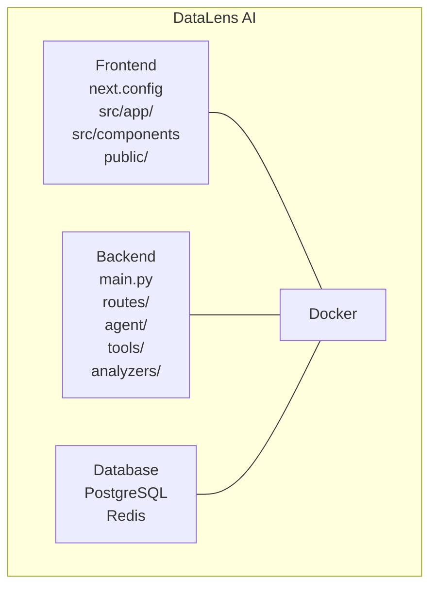

## Data Flow

### 1. File Upload Flow

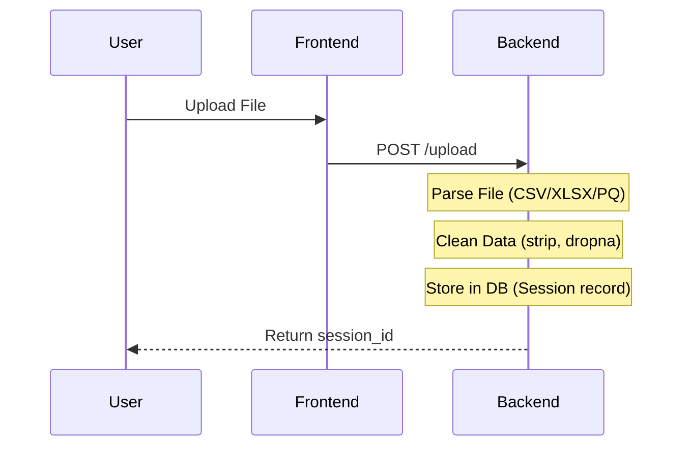

### 2. Chat Flow (WebSocket)

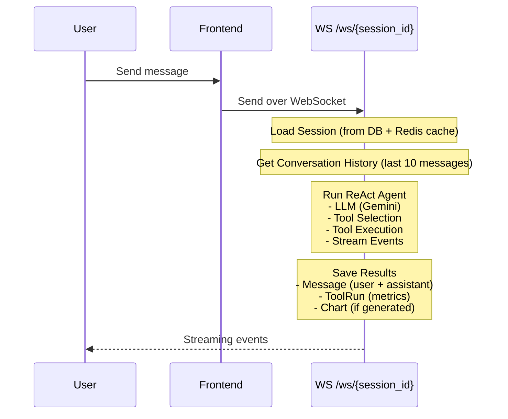

### 3. Agent Decision Flow

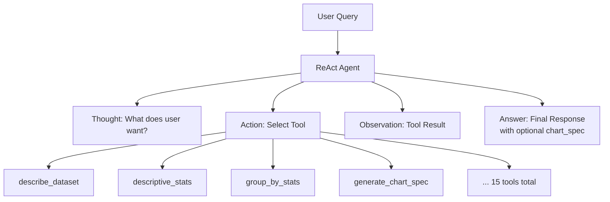

## Backend Architecture

### Layer Structure

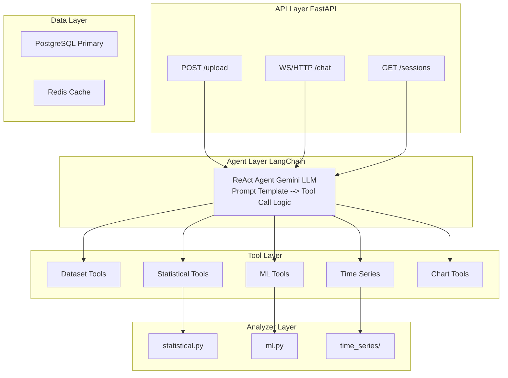

### Database Schema

```sql
-- Sessions: Uploaded datasets
CREATE TABLE sessions (
    id VARCHAR PRIMARY KEY,
    filename VARCHAR NOT NULL,
    schema JSONB NOT NULL,  -- columns, dtypes, shape
    data JSONB,             -- serialized dataframe (optional)
    created_at TIMESTAMP DEFAULT NOW(),
    updated_at TIMESTAMP
);

-- Messages: Chat history
CREATE TABLE messages (
    id SERIAL PRIMARY KEY,
    session_id VARCHAR REFERENCES sessions(id),
    role VARCHAR(20) CHECK (role IN ('user', 'assistant')),
    content TEXT,
    tool_name VARCHAR,
    tool_input JSONB,
    tool_result JSONB,
    created_at TIMESTAMP DEFAULT NOW()
);

-- Tool Runs: Execution metrics
CREATE TABLE tool_runs (
    id SERIAL PRIMARY KEY,
    session_id VARCHAR REFERENCES sessions(id),
    tool_name VARCHAR NOT NULL,
    input_json JSONB,
    result_json JSONB,
    duration_ms INTEGER,
    created_at TIMESTAMP DEFAULT NOW()
);

-- Charts: Generated visualizations
CREATE TABLE charts (
    id SERIAL PRIMARY KEY,
    session_id VARCHAR REFERENCES sessions(id),
    chart_type VARCHAR,
    vega_spec JSONB NOT NULL,
    query TEXT,  -- The question that generated this chart
    created_at TIMESTAMP DEFAULT NOW()
);
```

### Session State Management

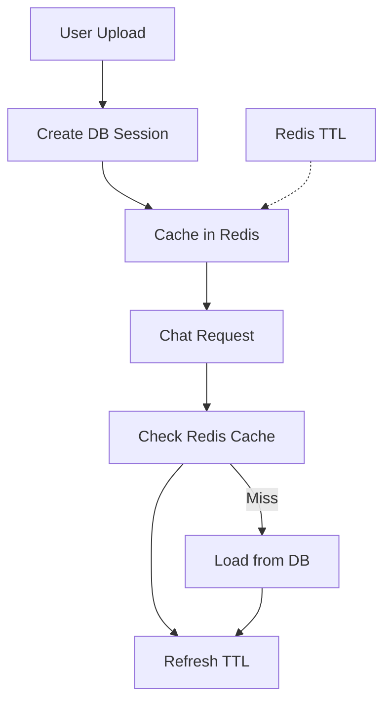

## Frontend Architecture

### Component Hierarchy

```mermaid
graph TD
    App[App Next.js] --> Layout
    App --> Pages
    App --> Shared[Shared Components]
    Layout --> Header
    Layout --> Sidebar
    Pages --> Home[/]
    Pages --> Chat[/chat/sessionId]
    Pages --> Sessions[/sessions]
    Home --> UploadZone --> FileDrop
    Chat --> ChatContainer
    Chat --> DatasetPreview
    ChatContainer --> MessageList
    ChatContainer --> ChatInput
    MessageList --> UserMessage
    MessageList --> AssistantMessage
    AssistantMessage --> TextContent
    AssistantMessage --> ChartRenderer --> VegaLiteChart
    AssistantMessage --> ToolSteps
    Sessions --> SessionList
    Shared --> Button
    Shared --> Card
    Shared --> Loading
    Shared --> ErrorBoundary
```

### State Management

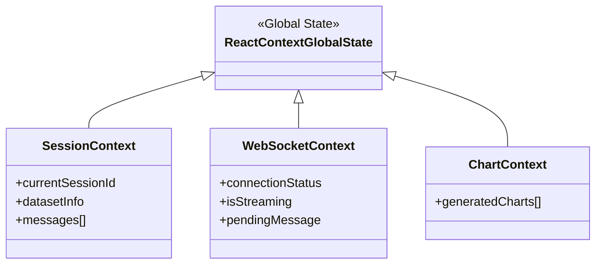

## Tool Registry

15 analytical tools organized by category:

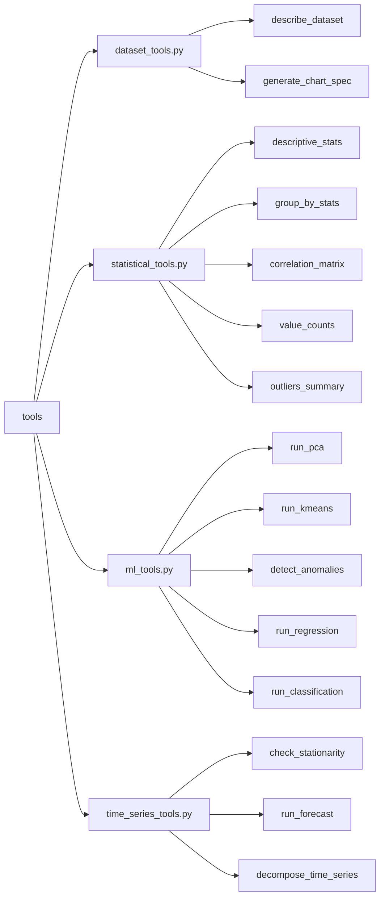

## Communication Patterns

### WebSocket Event Flow

```mermaid
sequenceDiagram
    participant Client
    participant Server
    Client->>Server: 1. Connect WS /ws/{id}
    Server-->>Client: 2. Accept Connection
    Client->>Server: 3. Send Message {"message": "..."}
    Server-->>Client: 4. Stream Events {"type": "thought"}
    Server-->>Client: {"type": "tool_call"}
    Server-->>Client: {"type": "tool_result"}
    Server-->>Client: {"type": "chart"}
    Server-->>Client: {"type": "answer"}
    Server-->>Client: {"type": "done"}
    Client<->>Server: 5. Close / Disconnect
```

## Scaling Considerations

### Horizontal Scaling

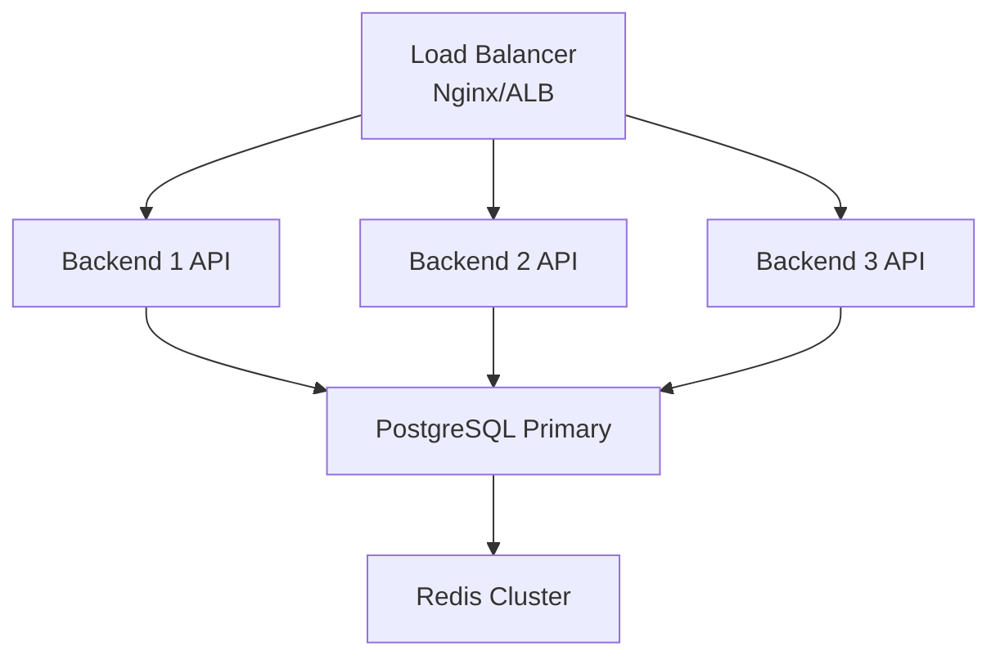

### Session Affinity

WebSocket connections require sticky sessions:
- Nginx: `ip_hash` or cookie-based
- ALB: Enable stickiness
- Cloud Run: Built-in session affinity

## Security Architecture

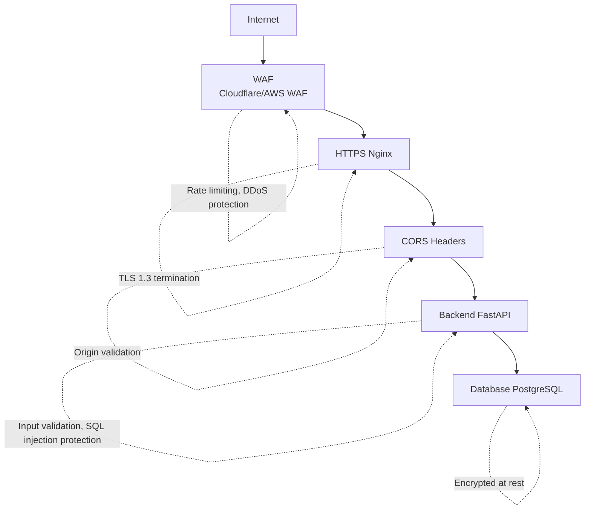
