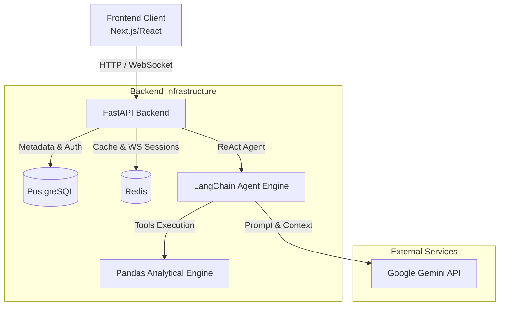
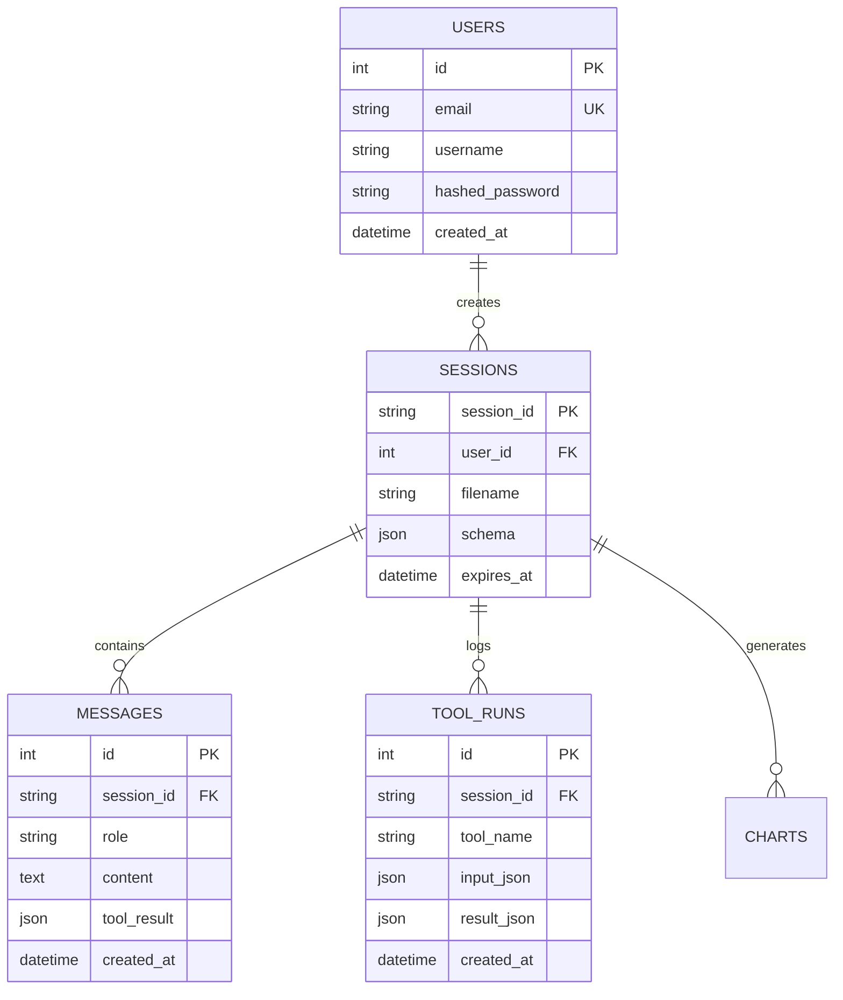
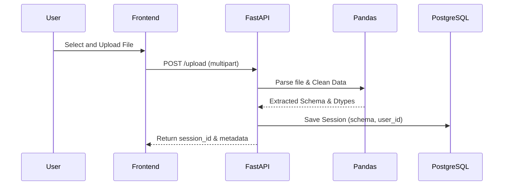
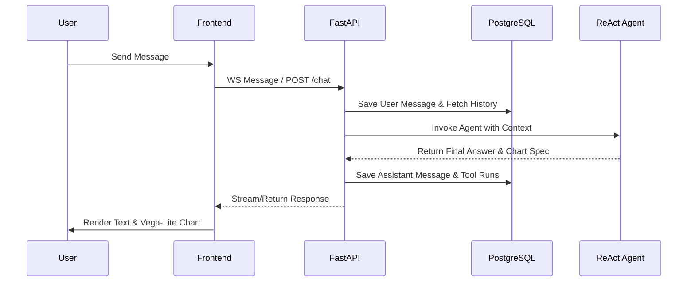
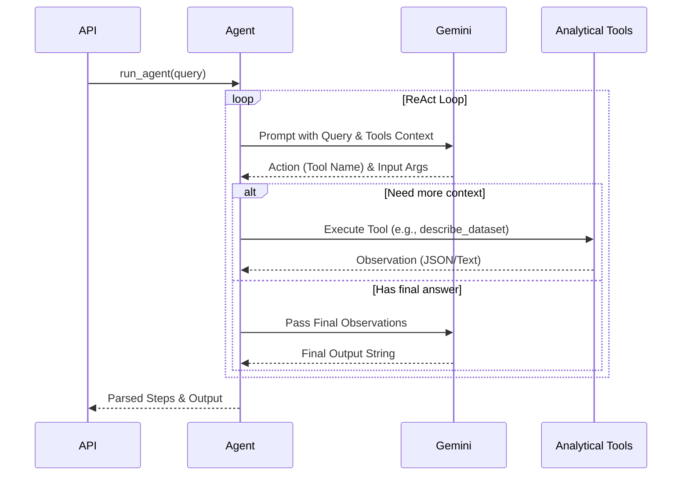
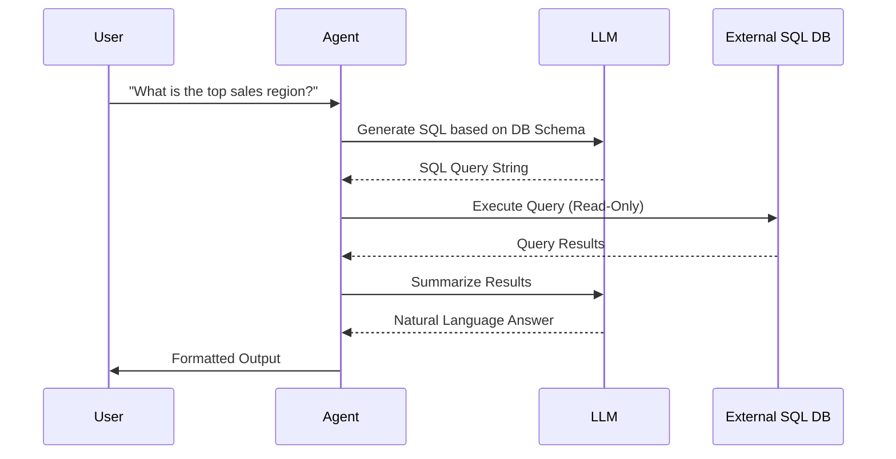
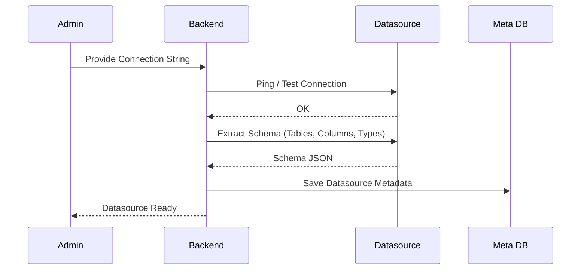

# DataLens AI: Technical Documentation

## Table of Contents
1. [Executive Summary](#1-executive-summary)
2. [Architecture Overview](#2-architecture-overview)
3. [Technology Stack](#3-technology-stack)
4. [Backend Architecture](#4-backend-architecture)
5. [Frontend Architecture](#5-frontend-architecture)
6. [Database Schema](#6-database-schema)
7. [Authentication & Authorization](#7-authentication--authorization)
8. [Core Features & Implementation Status](#8-core-features--implementation-status)
    - [Feature Matrix](#feature-matrix)
    - [AI Capabilities](#ai-capabilities)
9. [API Reference](#9-api-reference)
10. [Data Flow & Processing](#10-data-flow--processing)
    - [File Upload Flow](#file-upload-flow)
    - [Chat Message Flow (Standard Mode)](#chat-message-flow-standard-mode)
    - [Agentic AI Flow](#agentic-ai-flow)
    - [NL-to-SQL Query Flow](#nl-to-sql-query-flow)
    - [Datasource Workflow Flow](#datasource-workflow-flow)
11. [External Integrations](#11-external-integrations)
12. [Deployment & Infrastructure](#12-deployment--infrastructure)
    - [CI/CD Pipelines](#cicd-pipelines)
    - [PM2 Configuration](#pm2-configuration)
    - [Environment Variables](#environment-variables)
13. [Development Patterns & Conventions](#13-development-patterns--conventions)
14. [Known Limitations & Technical Debt](#14-known-limitations--technical-debt)
15. [Security Considerations](#15-security-considerations)
- [Appendix A: Quick Start for Contractors](#appendix-a-quick-start-for-contractors)
- [Appendix B: Changelog](#appendix-b-changelog)

---

## 1. Executive Summary
DataLens AI is an autonomous data analysis platform powered by a LangChain ReAct agent and Google Gemini. It allows users to upload structured datasets (CSV, Excel, Parquet) and query them using natural language. The system autonomously selects and chains appropriate analytical tools to return precise textual insights, statistical summaries, and dynamic Vega-Lite charts.

---

## 2. Architecture Overview



---

## 3. Technology Stack

### Frontend
- **Framework**: Next.js 16 (App Router), React 19
- **Styling**: Tailwind CSS v4, Shadcn/UI, Radix UI
- **State Management**: Zustand
- **Visualizations**: Recharts, Vega-Lite, Three.js (Fiber/Drei)
- **Testing**: Vitest, React Testing Library

### Backend
- **Framework**: FastAPI (Python 3.13+)
- **ORM & DB Engine**: SQLAlchemy (Async), PostgreSQL 15+
- **Data Processing**: Pandas
- **AI/ML**: LangChain, Groq API (Google Gemini), Scikit-learn, Statsmodels
- **Cache/WebSockets**: Redis (Local or Upstash)
- **Package Manager**: UV

---

## 4. Backend Architecture
The backend is built around a decoupled architecture focusing on clear separations of concerns:
- **Routes (`routes/`)**: Exposes REST and WebSocket endpoints (`auth`, `chat`, `upload`).
- **Agent Core (`agent/`)**: Contains the `analyst_agent.py` which manages the ReAct execution loop, prompt injection, and result parsing. Caches executors per session to reduce latency.
- **Analytical Tools (`tools/` & `analyzers/`)**: Granular, single-purpose Python functions mapped as LangChain tools (e.g., statistical analysis, anomaly detection, PCA, time series forecasting).
- **Session Layer (`session.py`)**: Manages the ephemeral lifecycle of user-uploaded Pandas dataframes.

---

## 5. Frontend Architecture
The frontend leverages Next.js 16 App Router for optimized rendering. 
- **Modular Components**: Uses highly reusable components driven by Shadcn UI and Tailwind CSS.
- **Real-Time Layer**: Uses WebSockets to stream agent chain-of-thought, tool execution statuses, charts, and final responses interactively.
- **State**: Uses Zustand for client-side state hydration and global store access without heavy prop drilling.

---

## 6. Database Schema



---

## 7. Authentication & Authorization
The application uses **JSON Web Tokens (JWT)**.
- **Endpoints**: `/auth/register` and `/auth/login`.
- **Validation**: Passwords hashed using bcrypt. Access tokens are passed as Bearer tokens in HTTP headers or via query strings for WebSocket initialization.
- **Session Ownership**: Every API request and WebSocket connection validates that the requested `session_id` belongs to the authenticated `user_id`.

---

## 8. Core Features & Implementation Status

### Feature Matrix
| Feature | Status | Notes |
|---------|--------|-------|
| User Authentication | Implemented | JWT, bcrypt |
| File Upload (CSV, XLSX, Parquet) | Implemented | Pandas ingestion and cleaning |
| Agentic LLM Chat (WS/HTTP) | Implemented | Groq/LangChain integration |
| Auto-Chart Generation | Implemented | Vega-Lite v5 specification outputs |
| Advanced ML/Stats Tools | Implemented | PCA, K-Means, ARIMA, Random Forest |

### AI Capabilities
The ReAct Agent uses the following specialized tools:
- **Descriptive**: `describe_dataset`, `descriptive_stats`, `value_counts`, `correlation_matrix`.
- **Machine Learning**: `run_pca`, `run_kmeans`, `detect_anomalies`, `run_regression`, `run_classification`.
- **Time Series**: `check_stationarity`, `run_forecast`, `decompose_time_series`.
- **Visuals**: `generate_chart_spec`.

---

## 9. API Reference
### Core Endpoints
- **POST `/auth/login`**: Authenticate and retrieve JWT.
- **POST `/upload`**: Upload a multipart/form-data dataset. Returns `session_id`.
- **GET `/sessions/{session_id}`**: Get dataset schema and metadata.
- **POST `/chat/{session_id}`**: Synchronous chat request.
- **WS `/ws/{session_id}`**: Streaming WebSocket for live agent thoughts, tool execution, and charts.

---

## 10. Data Flow & Processing

### File Upload Flow


### Chat Message Flow (Standard Mode)


### Agentic AI Flow


### NL-to-SQL Query Flow
*(Note: This represents the workflow for external database integrations. The current primary implementation relies on Pandas DataFrame analysis. This flow applies when Datasources are configured.)*


### Datasource Workflow Flow
*(Note: Represents the lifecycle of connecting and parsing an external datasource.)*


---

## 11. External Integrations
- **Google Gemini API**: Utilized via ChatGroq adapter in LangChain for reasoning, NLP tasks, and ReAct generation.
- **Redis (Local / Upstash)**: Used for WebSocket connection registries and distributed session caching.

---

## 12. Deployment & Infrastructure

### CI/CD Pipelines
Pipelines should run automated linting, type-checking, and tests (70+ backend tests cover API, Statistical, ML, and Time Series modules).
- **Backend Tests**: `uv run pytest tests/backend/ -v`
- **Frontend Tests**: `npm run test`

### PM2 Configuration
For deploying the Next.js frontend outside of Docker environments, PM2 is utilized to manage the Node process:
```json
{
  "apps": [
    {
      "name": "datalens-frontend",
      "script": "node_modules/next/dist/bin/next",
      "args": "start -p 3000",
      "env": {
        "NODE_ENV": "production"
      },
      "instances": "max",
      "exec_mode": "cluster"
    }
  ]
}
```

### Environment Variables
- `GEMINI_API_KEY`, `DB_USER`, `DB_PASSWORD`, `DB_NAME`, `DB_HOST`, `DB_PORT`, `REDIS_URL`, `JWT_SECRET_KEY`, `MAX_UPLOAD_MB`.

---

## 13. Development Patterns & Conventions
- **Asynchronous Execution**: Strict use of `async`/`await` across FastAPI endpoints, DB sessions, and LangChain executors.
- **Clean Architecture**: Strong boundary between external API requests (`routes/`) and internal business logic (`agent/`, `tools/`).
- **Defensive Error Handling**: Agent parses errors gracefully. Token limits and API errors are caught and returned to the user without crashing the service.
- **Strict Linting**: The frontend adheres strictly to ESLint rules and Next.js best practices; backend follows Python type hints and PEP-8 conventions.

---

## 14. Known Limitations & Technical Debt
- **In-Memory Constraints**: Pandas loads datasets entirely in-memory. Very large datasets (> configured `MAX_UPLOAD_MB`) are blocked to prevent OOM errors. Future iterations might require Dask or Spark for distributed dataframes.
- **Agent Cold Start**: Agent executor initialization has a slight delay. It is mitigated using `_executor_cache` which caches the initialized executor for 10 minutes per session.

---

## 15. Security Considerations
- **Input Validation**: Hard limits on message length (`MAX_MESSAGE_LENGTH = 4000`) and sanitization of user inputs.
- **Data Segregation**: `session_id` and `user_id` boundaries are strictly enforced via SQLAlchemy queries.
- **Rate Limiting**: Agent executions are capped at `MAX_REQUESTS_PER_WINDOW` concurrently per session using asyncio Semaphores to prevent Groq API rate limit abuses.
- **Read-Only execution**: Pandas functions invoked by the LLM are inherently decoupled from native OS commands.

---

## Appendix A: Quick Start for Contractors

### Backend Setup
```bash
cd backend
uv venv
source .venv/bin/activate  # or .venv\Scripts\Activate on Windows
uv sync
uv run uvicorn backend.main:app --reload
```

### Frontend Setup
```bash
cd frontend
npm install
npm run dev
```

---

## Appendix B: Changelog
- **v2.0.0**: 
  - Overhaul to Async architecture.
  - Added PM2 configuration recommendations.
  - Enhanced Agent Rate limiting and Executor caching.
  - Integration of Vega-Lite V5 for dynamic visualizations.
  - Implementation of JWT Auth and Redis WebSocket registries.
